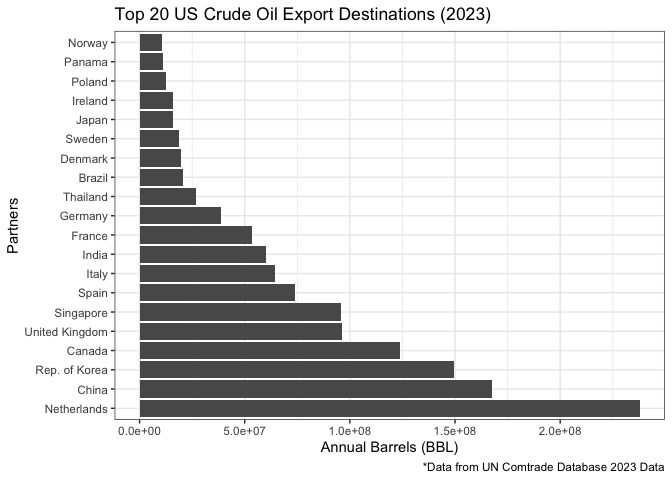

# README
Baxter Lowell

    ── Attaching core tidyverse packages ──────────────────────── tidyverse 2.0.0 ──
    ✔ dplyr     1.1.4     ✔ readr     2.1.6
    ✔ forcats   1.0.1     ✔ stringr   1.6.0
    ✔ ggplot2   4.0.1     ✔ tibble    3.3.1
    ✔ lubridate 1.9.4     ✔ tidyr     1.3.2
    ✔ purrr     1.2.1     
    ── Conflicts ────────────────────────────────────────── tidyverse_conflicts() ──
    ✖ dplyr::filter() masks stats::filter()
    ✖ dplyr::lag()    masks stats::lag()
    ℹ Use the conflicted package (<http://conflicted.r-lib.org/>) to force all conflicts to become errors

### Data

For this project I am looking at global crude oil trade data from 2023.
My data comes from the United Nations Comtrade Data set, which is a
comprehensive database for global trade, including hundreds of products,
imports and exports, and more. I also am using the Happy Planet Index to
introduce some additional variables.

### Questions

I want to explore both trade networks of crude oil for both the United
States and the entire world. Some basic questions I am looking to answer
are; Who does the US export the most oil to? Does exporting oil help to
lead to a better quality of life? What do trade networks look like for
individual countries?

The goal of this project is to create a tool that allows users to
analyze trade networks of a country of their choosing. Tools like this
can be used to try and predict who will be most effected by global
events that cause oil shortages or supply issues.

### First Graph: Who does the United States export oil to?

